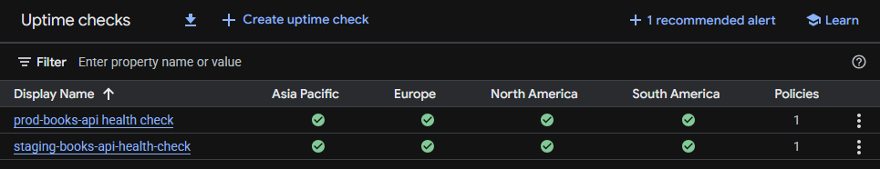

# books-api


A RESTful API built with Node.js and TypeScript. The application itself is intentionally simple — the focus of this project is the infrastructure and DevOps pipeline that surrounds it.

Built to get hands-on experience with Docker, Terraform, GCP, and GitHub Actions CI/CD.

---

## What it does

Takes a natural language book query, uses Claude AI to transform it into an optimised search string, hits the Google Books API with that query and returns results.

**Example:** "I want a scary horror book set in space" → Claude transforms this to `intitle:horror space science fiction thriller` → Google Books returns matching results.

---

## Endpoints

| Method | Endpoint        | Description                                                  |
| ------ | --------------- | ------------------------------------------------------------ |
| GET    | `/health`       | Returns 200 OK with timestamp. Used for pipeline smoke tests |
| POST   | `/books/search` | Accepts a natural language query, returns book results       |
| GET    | `/books/:id`    | Returns a single book by Google Books ID                     |

### Example request

```bash
curl -X POST https://books-api-prod-p6n7bhadia-ew.a.run.app/books/search \
  -H "Content-Type: application/json" \
  -d '{"query": "best books for learning python"}'
```

---

## Architecture

```
GitHub PR opened
      │
      ▼
GitHub Actions — run unit tests
      │
      ▼ (tests pass, PR merged to main)
GitHub Actions — build Docker image
      │
      ▼
Push image to GCP Artifact Registry
      │
      ▼
Deploy to Cloud Run (staging)
      │
      ▼
Smoke test hits /health endpoint
      │
      ▼ (on pass)
Deploy to Cloud Run (production)
      │
      ▼
Release tag created (vYYYY.MM.DD-<sha>)
```

**Infrastructure** is defined in Terraform and provisioned on GCP:

- **Cloud Run** — serverless container hosting, scales to zero when idle
- **Artifact Registry** — stores Docker images tagged by commit SHA
- **Environment variables** — API keys injected into Cloud Run at deploy time via GitHub secrets

---

## Tech stack

| Layer            | Technology                        |
| ---------------- | --------------------------------- |
| Runtime          | Node.js + TypeScript              |
| Framework        | Express                           |
| AI               | Anthropic Claude API              |
| External API     | Google Books API                  |
| Testing          | Jest + Supertest                  |
| Containerisation | Docker (multi-stage build)        |
| Infrastructure   | Terraform                         |
| Cloud            | GCP Cloud Run + Artifact Registry |
| CI/CD            | GitHub Actions                    |

---

## Project structure

```
books-api/
├── .github/
│   └── workflows/
│       ├── test.yml        # Runs on PRs and pushes to main
│       └── deploy.yml      # Runs after tests pass on main
├── api/
│   ├── routes/
│   │   └── books.ts        # Route handlers
│   ├── services/
│   │   ├── claudeService.ts    # Claude API integration
│   │   └── booksService.ts     # Google Books API integration
│   ├── types/
│   │   └── types.ts        # Shared TypeScript types
│   ├── utils/
│   │   └── logger.ts       # Winston structured logger
│   ├── app.ts              # Express app setup
│   └── index.ts            # Entry point
├── terraform/
│   ├── main.tf             # Cloud Run services and IAM
│   ├── variables.tf        # Input variables
│   └── outputs.tf          # Output values
├── tests/
│   └── books.test.ts       # Jest + Supertest tests
├── Dockerfile              # Multi-stage build
├── tsconfig.json
└── package.json
```

---

## Running locally

```bash
# Install dependencies
npm install

# Add environment variables
cp .env.example .env
# Fill in ANTHROPIC_API_KEY and GOOGLE_BOOKS_API_KEY

# Run in development
npm run dev

# Run tests
npm test

# Build and run with Docker
docker build -t books-api .
docker run -p 3000:3000 --env-file .env books-api
```

---

## Infrastructure

Provisioned on GCP via Terraform. Two Cloud Run services are deployed — staging and production — both in `europe-west1`.

```bash
cd terraform
terraform init
terraform plan
terraform apply
```

Outputs the staging and production URLs on apply.

---

## CI/CD pipeline

Every push to `main`:

1. Tests run
2. Docker image built and pushed to Artifact Registry tagged with commit SHA
3. Deployed to Cloud Run staging
4. Smoke test hits `/health` on staging
5. On pass, promoted to Cloud Run production
6. Release tag created in format `vYYYY.MM.DD-<sha>`

Pull requests only run tests — no deployment.

---

## Observability

**Structured logging** — all requests and errors are logged as JSON to stdout, captured by GCP Cloud Logging. Queryable by field:

```
jsonPayload.message="Claude structured query"
jsonPayload.resultCount=0
```

**Uptime monitoring** — GCP Uptime Checks hit `/health` every minute on both staging and production from multiple regions globally. Email alerts fire on consecutive failures.



**Rate limiting** — `/books` routes are limited to 50 requests per IP per 15 minutes to prevent abuse and protect API spend limits.

---

## Environment variables

| Variable               | Description                       |
| ---------------------- | --------------------------------- |
| `ANTHROPIC_API_KEY`    | Anthropic Console API key         |
| `GOOGLE_BOOKS_API_KEY` | GCP Books API key                 |
| `PORT`                 | Port to run on (defaults to 3000) |

In production these are set as GitHub Actions secrets and injected into Cloud Run at deploy time.
